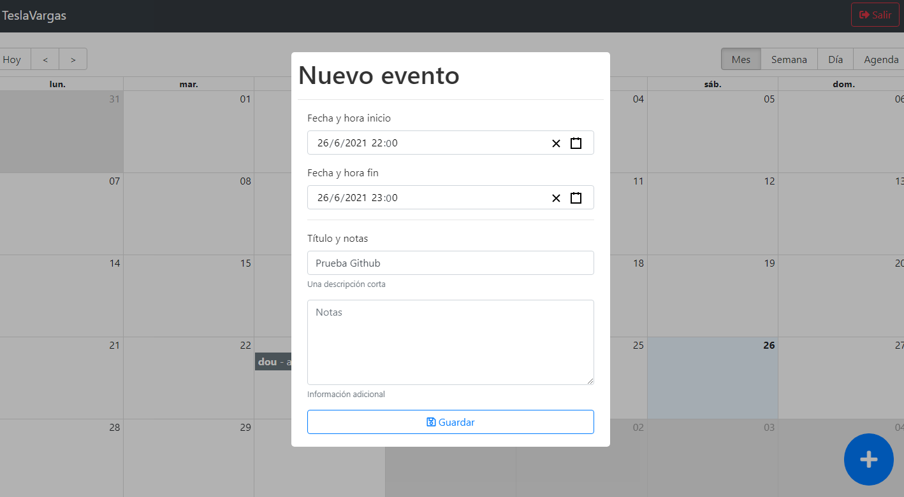

# Esta aplicación es un calendario público donde se pueden crear eventos a modo de recordatorio. 
# Está hecha con React Hooks, Redux y el backend utiliza MongoDB con JWT. 
# Tiene rutas protegidos, por lo tanto hay que registrarse (No hace falta que sean datos reales, los únicos requerimientos son que el email tenga un formato real y la contraseña tenga mínimo 6 dígitos). 
1